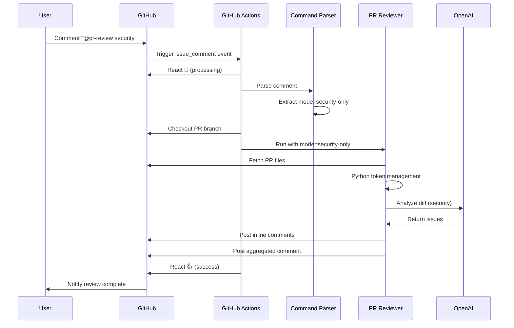

# Comment-Triggered Review Flow

## Architecture Diagram

```
┌─────────────────────────────────────────────────────────────┐
│                   GitHub PR Comment                         │
│                                                             │
│   User comments: "@pr-review security"                     │
└─────────────────┬───────────────────────────────────────────┘
                  │
                  ▼
┌─────────────────────────────────────────────────────────────┐
│         GitHub Actions: issue_comment event                 │
│                                                             │
│  1. Validate: Is this a PR comment?                        │
│  2. Check: Does comment contain "@pr-review"?              │
│  3. React: Add 👀 emoji (processing)                       │
└─────────────────┬───────────────────────────────────────────┘
                  │
                  ▼
┌─────────────────────────────────────────────────────────────┐
│              Command Parser                                 │
│                                                             │
│  Parse comment for command:                                │
│  - "@pr-review" → mode: auto                              │
│  - "@pr-review security" → mode: security-only            │
│  - "@pr-review quality" → mode: quality-only              │
│  - "@pr-review suggest" → mode: suggest-only              │
│  - "@pr-review help" → show help                          │
└─────────────────┬───────────────────────────────────────────┘
                  │
                  ▼
┌─────────────────────────────────────────────────────────────┐
│            Checkout PR Branch                               │
│                                                             │
│  git checkout refs/pull/${PR_NUMBER}/head                  │
└─────────────────┬───────────────────────────────────────────┘
                  │
                  ▼
┌─────────────────────────────────────────────────────────────┐
│         Run PR Reviewer Action                              │
│                                                             │
│  1. Fetch PR files                                         │
│  2. Token management (Python)                              │
│  3. Run review engines (based on mode)                     │
│  4. Post inline comments (critical/high)                   │
│  5. Post aggregated comment (medium/low/info)              │
└─────────────────┬───────────────────────────────────────────┘
                  │
                  ▼
┌─────────────────────────────────────────────────────────────┐
│              Post Results                                   │
│                                                             │
│  Success: React with 👍                                    │
│  Failure: React with 👎                                    │
└─────────────────────────────────────────────────────────────┘
```

## Flow Examples

### Example 1: Security-Only Review

```
1. Developer comments on PR #42: "@pr-review security"

2. GitHub Actions triggers:
   - Event: issue_comment.created
   - Condition: PR comment + contains "@pr-review"
   - Reaction: 👀 (eyes - processing)

3. Parser extracts: mode = "security-only"

4. Checks out: refs/pull/42/head

5. Runs PR Reviewer:
   - Fetches 15 files from PR
   - Token management: 8,500 tokens → 6,200 tokens (27% savings)
   - Runs security engine only
   - Finds: 2 critical, 3 high, 5 medium issues

6. Posts results:
   - 2 inline comments (critical)
   - 3 inline comments (high)
   - 1 aggregated comment (medium)

7. Reacts: 👍 (thumbs up - success)

Total time: 38 seconds
```

### Example 2: Full Review

```
1. Developer comments: "@pr-review"

2. GitHub Actions triggers:
   - Parser detects: mode = "auto" (default)

3. Runs all engines in parallel:
   - Security review: 25 seconds
   - Quality review: 22 seconds
   - Suggestions: 18 seconds

4. Merges results:
   - Security: 10 issues
   - Quality: 15 issues
   - Suggestions: 8 items

5. Posts:
   - 12 inline comments (critical/high from security + quality)
   - 1 aggregated comment (medium/low/info)
   - 1 suggestions summary

Total time: 52 seconds
```

### Example 3: Help Command

```
1. Developer comments: "@pr-review help"

2. GitHub Actions:
   - Parser detects: mode = "help"
   - Skips review execution

3. Posts help message:
   - Lists all available commands
   - Usage examples
   - Configuration options

Total time: 3 seconds
```

## Sequence Diagram



## Permission Requirements

The comment-triggered workflow requires these GitHub token permissions:

```yaml
permissions:
  pull-requests: write  # Post comments & reactions
  contents: read        # Read PR files
  # Note: Default GITHUB_TOKEN has these permissions
```

## Configuration

### Workflow File

Located at: `.github/workflows/comment-triggered.yml`

Key sections:

```yaml
on:
  issue_comment:
    types: [created]  # Trigger on new comments

jobs:
  review:
    if: |
      github.event.issue.pull_request &&        # Is PR (not issue)
      contains(github.event.comment.body, '@pr-review')  # Has trigger
```

### Customization

You can customize behavior by editing the workflow:

**Change trigger phrase:**
```yaml
if: contains(github.event.comment.body, '@bot-review')  # Custom trigger
```

**Add more commands:**
```yaml
- name: Parse command
  run: |
    if echo "$COMMENT" | grep -q "@pr-review fast"; then
      MODE="security-only"
      MODEL="gpt-4o-mini"  # Use faster/cheaper model
    fi
```

**Restrict to team members:**
```yaml
- name: Check permissions
  if: |
    !contains(fromJSON('["user1", "user2"]'), github.event.comment.user.login)
  run: |
    echo "Only team members can trigger reviews"
    exit 1
```

## Comparison: Auto vs Comment-Triggered

| Feature | Auto (pull_request) | Comment-Triggered |
|---------|:-------------------:|:-----------------:|
| **Trigger** | On PR open/update | On comment |
| **Use case** | Continuous review | On-demand review |
| **PR state** | Latest changes only | Entire PR |
| **Control** | Automatic | Manual |
| **Cost** | Every commit | Only when requested |
| **Latency** | Immediate | User-triggered |

**Recommendation:** Use both!
- Auto review: For continuous feedback on new commits
- Comment-triggered: For re-reviews, specific checks, or existing PRs

### Example: Both Workflows

```yaml
# Auto review on every commit
# .github/workflows/pr-review.yml
on:
  pull_request:
    types: [opened, synchronize]

# Manual review via comments
# .github/workflows/comment-triggered.yml
on:
  issue_comment:
    types: [created]
```

This gives you:
- ✅ Automatic review on every push
- ✅ Manual review for deep-dives
- ✅ Specific mode selection (security-only, etc.)
- ✅ Re-review capability

## Troubleshooting

### Comment not triggering

**Problem:** Commented `@pr-review` but nothing happened

**Debug steps:**
1. Check GitHub Actions tab → Should see workflow run
2. If no workflow run:
   - Verify `.github/workflows/comment-triggered.yml` exists
   - Check workflow is enabled in repo settings
   - Ensure comment is on a **PR**, not an issue
3. If workflow runs but fails:
   - Check logs for error
   - Verify `OPENAI_API_KEY` secret exists

### Bot reacts but no comments

**Problem:** Bot reacts 👍 but no review comments posted

**Possible reasons:**
1. No issues found (clean code!)
2. All issues below severity threshold
3. Issues without file locations (can't post inline)

**Solution:** Check aggregated comment for all findings

### Multiple simultaneous reviews

**Problem:** User comments multiple commands quickly

**Behavior:**
- Each command triggers independent workflow run
- All run in parallel
- Each posts separate comments
- Can cause rate limiting

**Recommendation:**
- Wait for previous review to complete
- Use GitHub Actions UI to cancel redundant runs

## Best Practices

1. **Use specific commands**: `@pr-review security` is faster than full review
2. **Wait between reviews**: Don't spam commands
3. **Check reactions**: 👀 = processing, 👍 = done, 👎 = error
4. **Read aggregated comment**: Contains all findings, not just inline
5. **Customize workflow**: Adjust thresholds, ignore patterns, model selection

## Advanced: Custom Commands

You can extend the parser to add custom commands:

```yaml
- name: Parse command
  run: |
    if echo "$COMMENT" | grep -q "@pr-review critical-only"; then
      MODE="security-only"
      THRESHOLD="critical"
      echo "mode=$MODE" >> $GITHUB_OUTPUT
      echo "threshold=$THRESHOLD" >> $GITHUB_OUTPUT
    fi

- name: Run PR Reviewer
  with:
    inline-severity-threshold: ${{ steps.parse.outputs.threshold }}
```

Now users can comment: `@pr-review critical-only`

---

For more examples and documentation:
- [COMMANDS.md](../COMMANDS.md) - Full command reference
- [README.md](../README.md) - Main documentation
- [Example workflow](../.github/workflows/example.yml) - Auto reviews
